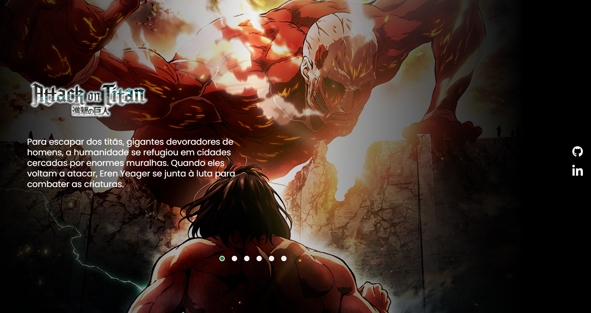

# Carrossel-Attack-on-Titan

 

### 📃 Descrição:

Meu primeiro projeto usando um pouco de JavaScript. O objetivo era colocar em prática as habilidades que estava aprendendo dentro do curso.

### 🚀 Tecnologias Utilizadas 

    
    
    

### 📸 Screenshot:

